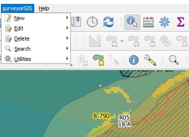

surveyorGIS (sGIS)

v3.40.1a  
2024.03.DEC 

 
updated to ensure compatibility with latest QGIS (v3.40.1)  
<ul>
<li>sanitized - all references to BRS/LA and all hardcoded paths/values removed</li>
<li>config.json - org specific configuration is now maintained in external file and read at plugin load/reload...</ul>
<a href=mailto:t.schmaltz@brsmaine.com>contact</a>

